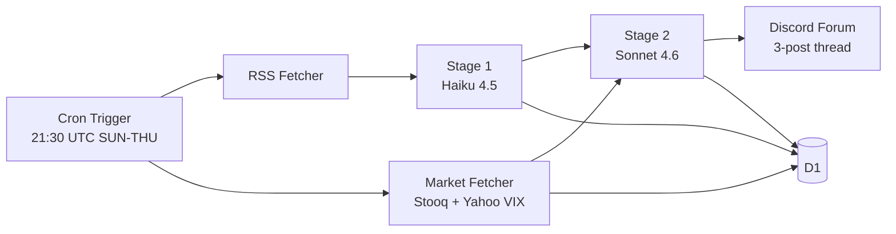
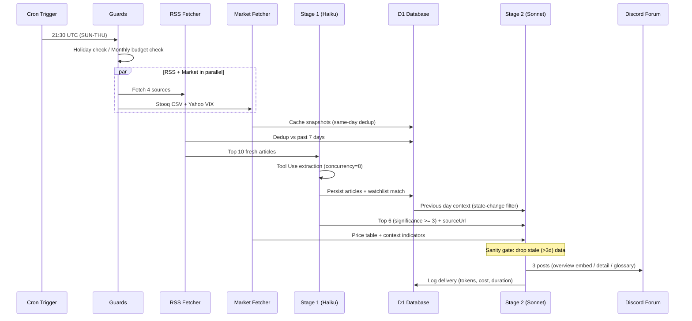
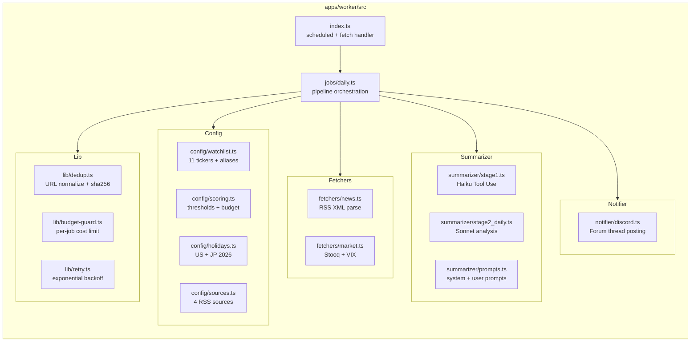
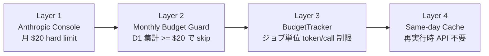

# finews

平日朝・週次・月次に金融マーケットダイジェストを Discord に配信する個人向けパイプライン。
Cloudflare Workers + D1 + Drizzle + Anthropic API で構築。



## ドキュメント

- 設計書: [`docs/superpowers/specs/2026-05-23-finews-design.md`](docs/superpowers/specs/2026-05-23-finews-design.md)
- ADR: [`docs/adr/`](docs/adr/)(0001〜0006)
- Phase 1 実装計画: [`docs/superpowers/plans/2026-05-23-finews-phase-1.md`](docs/superpowers/plans/2026-05-23-finews-phase-1.md)
- Phase 1.5 申し送り: [`docs/superpowers/specs/2026-05-24-phase-1.5-handoff.md`](docs/superpowers/specs/2026-05-24-phase-1.5-handoff.md)
- **手動作業 runbook**(初回デプロイ・シークレットローテーション・月次運用・障害対応): [`docs/operations.md`](docs/operations.md)

## ステータス

- Phase 1(半導体 1 セクター、Discord embed): 本番稼働中
- Phase 1.5(値動きシグナル + Forum + ウォッチリスト改善): 本番稼働中
- Phase 2(残り 3 セクター、weekly/monthly、Gemini 切替): 計画中

## セットアップ

```bash
pnpm install
cd apps/worker
pnpm db:migrate:local       # ローカル D1 にスキーマ適用
```

## 開発

```bash
pnpm typecheck              # ワークスペース全体の型チェック
pnpm test                   # Vitest(dedup + budget-guard、Stage 1 は live API なので skip)
cd apps/worker && pnpm dev  # wrangler dev でローカル起動
```

Cron handler の手動発火:

```bash
cd apps/worker
pnpm wrangler dev --test-scheduled
# 別ターミナル
curl "http://localhost:8787/__scheduled?cron=30+21+*+*+SUN-THU"
```

ソース到達性チェック(初回 + サードパーティ仕様変更を疑った時に):

```bash
./scripts/verify-sources.sh
```

## デプロイ

詳細手順とチェックリストは [`docs/operations.md`](docs/operations.md)。以下は概要。

### 1. Anthropic Console で月予算 $20 を設定(ADR-0006 Layer 1)

ブラウザで `https://console.anthropic.com/settings/billing` を開き、**Monthly spend limit = $20 USD** を設定。Usage alerts(50% / 80%)も有効化。

### 2. 本番 D1 にマイグレーション適用

```bash
cd apps/worker
pnpm db:migrate:remote
```

### 3. デプロイ

```bash
cd apps/worker
pnpm run deploy
```

> `wrangler secret put` は Worker が Cloudflare 側に存在しないと "Worker not found" になるため、**deploy → secrets の順**で実行する。

### 4. シークレット設定

```bash
cd apps/worker
pnpm wrangler secret put ANTHROPIC_API_KEY
pnpm wrangler secret put DISCORD_WEBHOOK_URL
```

### 5. リハーサル

```bash
cd apps/worker
pnpm wrangler dev --test-scheduled --remote
# 別ターミナル
curl "http://localhost:8787/__scheduled?cron=30+21+*+*+SUN-THU"
```

→ Discord チャネルに半導体領域のダイジェスト 1 通が届けば Phase 1 完了。

## スクリプト一覧

| コマンド | 説明 |
|---|---|
| `pnpm typecheck` | 全ワークスペースの TypeScript チェック |
| `pnpm test` | Vitest 実行 |
| `pnpm dev` | wrangler dev でローカル起動 |
| `pnpm run deploy`(子 workspace 内) | wrangler deploy で本番デプロイ。`run` を省略すると pnpm built-in の workspace deploy が走るので注意 |
| `cd apps/worker && pnpm db:generate` | drizzle-kit でマイグレーション生成 |
| `cd apps/worker && pnpm db:migrate:local` | ローカル D1 にマイグレーション適用 |
| `cd apps/worker && pnpm db:migrate:remote` | 本番 D1 にマイグレーション適用 |
| `./scripts/verify-sources.sh` | RSS / 外部ソース到達性確認 |

## アーキテクチャ概要

### パイプラインシーケンス



### コンポーネント構成



### コスト防御の多層構造



詳細は[設計書](docs/superpowers/specs/2026-05-23-finews-design.md)参照。

## コスト

月額 約 $15-17(Workers Paid $5 + Anthropic 約 $10-12)。詳細は[ADR-0006](docs/adr/0006-cost-spike-guardrails.md)。

## ライセンス

個人プロジェクト(no license / proprietary)。
