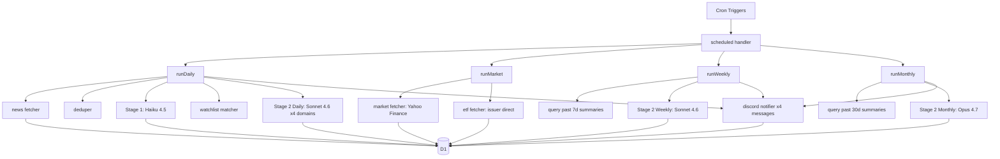

# finews 設計書

| 項目 | 内容 |
|---|---|
| Date | 2026-05-23 |
| Status | Draft (ユーザーレビュー待ち) |
| Owner | @paveg |
| 関連 ADR | [0001](../../adr/0001-cloudflare-workers-d1-stack.md) [0002](../../adr/0002-two-stage-llm-summarization.md) [0003](../../adr/0003-discord-domain-split-delivery.md) [0004](../../adr/0004-etf-flow-data-source-strategy.md) [0005](../../adr/0005-cron-trigger-job-architecture.md) [0006](../../adr/0006-cost-spike-guardrails.md) |

## 1. プロジェクト目的

**finews** は平日朝・週次・月次に金融マーケットダイジェストを Discord に配信する個人向けパイプライン。

1. 投資全般、半導体・AIテック、金融マクロの動向を効率的に把握する
2. ETF フローを軸に「市場全体の意思」を捉える(個別株のノイズを避ける)
3. 専門用語の注釈と「読み解きの型」で金融ニュース読解力を向上させる
4. **保有銘柄の管理は行わない**(証券口座アプリと二重管理を回避)

## 2. 設計ポリシー

| 原則 | 具体策 |
|---|---|
| Config-driven | ニュース・指標・ETF はすべて配列定義、追加は 1 行〜数行で完結 |
| 二段階要約 | Haiku 抽出 → Sonnet 分析 → 月次のみ Opus(ADR-0002) |
| 構造化保存 | D1 に蓄積し、過去文脈を Stage 2 に注入 |
| シンプル配信 | Discord 1 チャネルに集約、領域別 4 メッセージ分割(ADR-0003) |
| シンプル実行 | Cron Trigger 直叩き、Queues/Workflows 不使用(ADR-0005) |

## 3. 配信スケジュール (JST)

| ジョブ | Cron (UTC) | JST | 内容 |
|---|---|---|---|
| daily | `30 21 * * 0-4` | 平日 6:30 | 朝刊(前夜の米市場 + 当日の日本市場注目点) |
| market | `0 22 * * 0-4` | 平日 7:00 | 市場指標・ETF スナップショット取得 |
| weekly | `30 23 * * 5` | 土曜 8:30 | 週次まとめ + 用語まとめ |
| monthly | `0 0 1 * *` | 月初 9:00 | 月次振り返り + 読解力チェック |

**注意点**:
- すべて `>=1h interval` のため Workers Cron Trigger で **CPU 15 分** 利用可能(ADR-0005)
- **DST 非対応**: 米市場引け時刻は EDT(夏)/EST(冬)で 1 時間ずれる。`market` ジョブの 7:00 JST は冬時間で引け+1時間、夏時間で引け直後。ETF データが未確定の可能性があるため、`market_fetcher` 内でリトライ(最大3回・5分間隔)実装
- **休場日**: `config/holidays.ts` に米日固定リストを持ち、`isMarketHoliday(date, market)` で early-return

## 4. アーキテクチャ



レイヤー責務:

- **fetchers/**: 外部データ取得(失敗時は静かに skip)
- **summarizer/**: LLM 呼び出し、プロンプト管理
- **matchers/**: 記事と watchlist のひも付け
- **notifier/**: Discord 配信
- **db/**: D1 アクセス(Drizzle)
- **lib/**: dedup, glossary, errors

## 5. データフロー

### 5.1 平日朝刊 (daily)

1. `news_fetcher` が全 RSS ソースを `Promise.allSettled` で並列取得(失敗ソースは skip)
2. `deduper` で既存 articles と URL の sha256 比較し新着のみ抽出
3. 新着記事を `priority * recency` でソートし**上位 25 件**に絞る(コスト・CPU 制御)
4. Stage 1 (Haiku) を **並列度 3** で実行、構造化 JSON を articles テーブルに保存
5. `watchlist_match` で関心銘柄関連にフラグ + `継続テーマ` フラグ計算(過去 3 日の出現頻度ベース、決定論的)
6. 市場指標・ETF フローを D1 から取得(前日 7:00 の market ジョブで保存済み)
7. Stage 2 (Sonnet) を**ドメイン別に 4 回直列呼び出し**(prompt caching を効かせる)
   - 各回でその領域の Stage 1 結果 + 市場指標 + ETF + watchlist + 過去 3 日 summaries(同領域)を渡す
8. summaries テーブルに 4 レコード保存
9. `discord_notifier` で 4 メッセージ送信(250ms 間隔、2-4 通目は suppress_notifications)
10. `deliveries` に成否ログ

### 5.2 平日指標 (market)

1. `market_fetcher`: Yahoo Finance から VIX/DXY/^TNX/JPY=X/CL=F/^SOX(失敗時は最大3回リトライ)
2. `etf_fetcher`:
   - 価格・出来高は Yahoo Finance(全銘柄)
   - shares_outstanding と flow は ADR-0004 の戦略に従い、Phase 1.5 で iShares 3銘柄 + Global X 2銘柄
3. `market_snapshots` / `etf_snapshots` に保存

### 5.3 週次 (weekly)

1. 過去 7 日の `summaries` を query
2. 過去 7 日の `glossary` を出現頻度で集計
3. Stage 2 Weekly (Sonnet) で総括生成
4. Discord に 1 メッセージで配信

### 5.4 月次 (monthly)

1. 過去 30 日の `summaries` + `glossary` を query
2. Stage 2 Monthly (Opus 4.7) で振り返り生成
3. Discord に 1 メッセージで配信

## 6. ディレクトリ構成

```
finews/
├── apps/worker/
│   ├── src/
│   │   ├── index.ts                 # scheduled handler
│   │   ├── jobs/{daily,market,weekly,monthly}.ts
│   │   ├── fetchers/{news,market,etf}.ts
│   │   ├── summarizer/{stage1,stage2_daily,stage2_weekly,stage2_monthly,prompts}.ts
│   │   ├── matchers/{watchlist,continuing_theme}.ts
│   │   ├── notifier/discord.ts
│   │   ├── db/{schema,client}.ts
│   │   ├── db/migrations/
│   │   ├── config/{sources,domains,holidays,aliases}.ts
│   │   └── lib/{dedup,glossary,errors,retry}.ts
│   ├── test/                        # vitest
│   ├── wrangler.toml
│   ├── drizzle.config.ts
│   └── package.json
├── packages/shared/src/schemas.ts   # Valibot 共有スキーマ
├── docs/
│   ├── adr/                         # ADR-0001 〜 0005
│   └── superpowers/specs/           # この設計書
├── pnpm-workspace.yaml
└── package.json
```

## 7. D1 スキーマ (Drizzle)

(指示書セクション 5 の `articles / summaries / watchlist / market_snapshots / etf_snapshots / glossary / deliveries` をベースに、以下を追加)

### 追加・変更点

- `articles` に `continuing_theme_score: integer` 追加(0-100、過去 3 日の同領域同 ticker 出現頻度ベース)
- `watchlist` に `aliases: text` (JSON array) 追加 — 例: NVDA なら `["Nvidia", "エヌビディア", "ｴﾇﾋﾞﾃﾞｨｱ"]`
- `etf_snapshots` の `flow_1d` / `flow_5d` を `nullable` に(Phase 1.5 で取れない銘柄向け)
- `deliveries` を**ジョブログ全般**に転用:
  - `id`, `job_type`, `step` ('fetch_news' | 'stage1' | 'stage2_domain_X' | 'discord_send' | ...)
  - `status`, `error`, `duration_ms`, `attempted_at`

## 8. ソース定義

### 8.1 ニュースソース (config/sources.ts)

| id | domain | priority | RSS生存 (2026-05-23) | description |
|---|---|---|---|---|
| frb_press | us_macro | 1 | ✅ 確認済 | title と同一(本文なし) |
| boj | jp_macro | 1 | ✅ 確認済 | 空 |
| nikkei_xtech_semi | semiconductor | 1 | ✅ 確認済 | **冒頭文章あり**(優先度高) |
| reuters_tech | semiconductor | 1 | ❓ Claude Code環境では 403、Workers で要検証 | 過去は本文込み |
| reuters_markets | us_macro | 1 | ❓ 同上 | 過去は本文込み |
| bbc_business | us_macro | 2 | ✅ 確認済(代替候補) | 冒頭1文程度 |
| tdnet | earnings | 2 | ❌ 公式 RSS なし、HTML scrape 必要 | (Phase 2 で検討) |

**フォールバック方針**: Reuters が Workers から取れない場合、`bbc_business` + `nikkei_xtech_semi` + 後続で見つける米国系 RSS で代替。AP News, MarketWatch, Investing.com も候補。

### 8.2 市場指標

| id | symbol | domain |
|---|---|---|
| vix | ^VIX | market_context |
| dxy | DX-Y.NYB | market_context |
| us10y | ^TNX | us_macro |
| usdjpy | JPY=X | jp_macro |
| wti | CL=F | market_context |
| sox | ^SOX | semiconductor |

### 8.3 ETF (ADR-0004)

| id | symbol | domain | flowProvider | Phase |
|---|---|---|---|---|
| soxx | SOXX | semiconductor | ishares | 1.5 |
| smh | SMH | semiconductor | null (price+volumeのみ) | 1.5 |
| aiq | AIQ | ai_tech | globalx | 1.5 |
| botz | BOTZ | ai_tech | globalx | 1.5 |
| spy | SPY | us_macro | null → spdr (Phase 2) | 1.5/2 |
| qqq | QQQ | us_macro | null → invesco (Phase 2) | 1.5/2 |
| tlt | TLT | us_macro | ishares | 1.5 |
| hyg | HYG | us_macro | ishares | 1.5 |
| 1306 | 1306.T | jp_macro | null | 1.5 |
| 1545 | 1545.T | semiconductor | null | 1.5 |

## 9. プロンプト設計

### 9.1 Stage 1 (Haiku 4.5)

**入力**: 1 記事の `title` + `description` (RSS 由来、最大 500 字)。本文 fetch は Phase 2 で検討。

**出力 (Valibot 検証)**:

```typescript
export const ExtractedArticleSchema = v.object({
  headline_ja: v.pipe(v.string(), v.maxLength(80)),
  category: v.picklist(['earnings', 'policy', 'product', 'macro_indicator', 'm&a', 'other']),
  tickers: v.array(v.string()),
  ticker_aliases_used: v.array(v.string()), // 本文中の表記("Nvidia", "エヌビディア" 等)
  indicators: v.array(v.string()),
  key_numbers: v.array(v.object({ label: v.string(), value: v.string() })),
  significance: v.pipe(v.number(), v.minValue(1), v.maxValue(5)),
  rationale: v.pipe(v.string(), v.maxLength(60)),
  glossary_terms: v.array(v.object({
    term: v.string(),
    definition: v.pipe(v.string(), v.maxLength(50)),
  })),
});
```

**プロンプト要点**:
- 出力ルール厳守(JSON のみ、前置き禁止)
- `tickers` は正規化(Nvidia/エヌビディア → "NVDA")、元表記は `ticker_aliases_used` に
- `significance`: 1=些末, 5=市場を動かす重要材料
- `glossary_terms` は最大 3 つ、基本用語(GDP/CPI/FOMC/決算/為替/利回り/ETF)は除外

### 9.2 Stage 2 Daily (Sonnet 4.6) — ドメイン別 4 回呼び出し

**入力**:
- そのドメインの Stage 1 結果配列(significance 降順、上位 N=6 件)
- 市場指標スナップショット(全領域)
- ETF flow(該当ドメイン)
- watchlist(該当ドメインのみ)
- 過去 3 日の同ドメイン summaries(継続テーマ判定用)
- `continuing_theme_score >= 60` の記事に「継続テーマ」フラグ

**キャッシュ戦略** (ADR-0002):

```typescript
{
  model: "claude-sonnet-4-6",
  system: [
    { type: "text", text: SYSTEM_PROMPT_GENERAL, cache_control: { type: "ephemeral" } },
    { type: "text", text: DOMAIN_DEFINITIONS, cache_control: { type: "ephemeral" } },
    { type: "text", text: FORMAT_RULES, cache_control: { type: "ephemeral" } },
  ],
  messages: [
    { role: "user", content: dynamicPayload },
  ],
}
```

3 つのシステムブロック合計 ~20k tokens を 5 分キャッシュ。4 ドメイン直列実行で 3 ヒット見込み。

**ハルシネーション対策**:
- プロンプト末尾に明示: 「数値・固有名詞は **必ず key_numbers / tickers から引用** すること。新たな数値や記事に無い因果を創出してはならない」
- 「不確実な解釈は 'と見られる' 'の可能性がある' で明示」

**出力**: 1 ドメイン分の Discord embed 用 Markdown(title + description 最大 3500 字)。

### 9.3 Stage 2 Weekly (Sonnet 4.6)

入力: 過去 7 日の summaries + glossary 頻度集計
出力: 1 embed(マクロトレンド/半導体・AIテック/来週イベント/今週の用語)

### 9.4 Stage 2 Monthly (Opus 4.7)

入力: 過去 30 日 summaries + glossary
出力: 1 embed(ジャンル分布/継続テーマ/読解力チェックリスト)

## 10. Discord 配信フォーマット (ADR-0003)

- daily: **4 メッセージ × 1 embed**(領域別)、各最大 ~4000 字
- weekly: 1 メッセージ × 1 embed、~4000 字
- monthly: 1 メッセージ × 1 embed、~5000 字
- 領域色分け: 半導体=`0x3498DB`(青)、米マクロ=`0x2ECC71`(緑)、日マクロ=`0xE74C3C`(赤)、決算=`0xF1C40F`(黄)
- daily 2 通目以降は `flags: 4096` (SUPPRESS_NOTIFICATIONS)

## 11. モデル割当

| 用途 | モデル ID | 価格(input/output) |
|---|---|---|
| Stage 1 | `claude-haiku-4-5-20251001` | $1 / $5 per MTok |
| Stage 2 Daily | `claude-sonnet-4-6` | $3 / $15 per MTok |
| Stage 2 Weekly | `claude-sonnet-4-6` | $3 / $15 per MTok |
| Stage 2 Monthly | `claude-opus-4-7` | $5 / $25 per MTok |

prompt caching の最小キャッシュサイズ:
- Sonnet 4.6: **1024 tokens** (設計の 20k 余裕)
- Haiku 4.5: 4096 tokens (Stage 1 は短いプロンプトでキャッシュ非対象)
- Opus 4.7: 4096 tokens

## 12. コスト試算 (修正版)

| 項目 | 月額 |
|---|---|
| Stage 1 (Haiku, 22日 × 25記事) | $3.0 |
| Stage 2 Daily (Sonnet, 22日 × 4ドメイン, 70%キャッシュヒット) | $4.5 |
| Stage 2 Weekly (Sonnet, 4回) | $2.5 |
| Stage 2 Monthly (Opus, 1回) | $0.5 |
| **Anthropic 小計** | **約 $10.5** |
| Cloudflare Workers Paid | $5 |
| D1 | $0 (無料枠) |
| Discord Webhook | $0 |
| **総合計** | **約 $15.5/月** |

## 13. テスト戦略

- フレームワーク: **Vitest** + `@cloudflare/vitest-pool-workers`
- **Phase 1 必須テスト** (TDD で先に書く):
  - Stage 1 Valibot 検証 (golden test: 3 件の fixture 記事 → 期待 JSON)
  - `dedup` の sha256 + URL 正規化
- **Phase 1.5 で追加**:
  - `discord_notifier` の embed 長計算と分割ロジック(各 embed が 6000/領域内に収まる)
  - `continuing_theme` のスコア計算
  - `watchlist` の alias マッチング
- **Phase 2 で導入**:
  - Stage 2 を fixture 入力で叩き、LLM-as-judge で品質スコア(回帰検知)

## 14. 検証 TODO (Phase 1 着手前に解決)

1. **Workers から Reuters / Bloomberg / Nikkei xTech RSS が取得可能か**
   - Claude Code WebFetch は Reuters でブロックされた。Workers の IP レンジでは取得できる可能性が高いが、Phase 1 の最初 30 分で確認
2. **Workers から iShares / Global X CSV が取得可能か** (ADR-0004 参照)
3. **TDnet 開示の取得方法**(公式 RSS なしを確認、HTML scrape の難度と利用規約)
4. **Yahoo Finance の `^SOX` などインデックス取得が Workers から安定するか**
5. **Discord Webhook の SUPPRESS_NOTIFICATIONS flag (4096) が現在も有効か**
6. **Anthropic Console で月予算 $20 設定** が完了しているか(ADR-0006 Layer 1、Phase 1 開始時の必須手順)

## 15. Phase ロードマップ

### Phase 1 (週末半日)

1. リポジトリ初期化、wrangler/D1 セットアップ、Drizzle スキーマ適用 — 30分
2. **検証 TODO #1, #4 を最初に潰す**(失敗するソースを早期発見) — 30分
3. RSS フェッチャ + 3-5 ソースで動作確認 — 45分
4. **Stage 1 の Valibot 検証テストを fixture 3 件で先に書く (Red)** — 30分
5. Stage 1 実装 (Haiku 呼び出し) — Green まで — 1h
6. Stage 2 Daily 1 ドメイン版 + Discord 配信 — 1h
7. Cron Trigger 設定、手動トリガで本番リハ — 30分
8. 残りソースを config に追加 — 15分

**完了条件**: 平日朝に 1-2 領域のダイジェストが Discord に届く(ETF データなしでも可)

### Phase 1.5 (翌週末)

- 残り 3 領域を Stage 2 で実装(計4メッセージ配信)
- `market_fetcher` + `etf_fetcher` (ADR-0004 の戦略で 5 銘柄)
- `watchlist` + alias マッチング
- 継続テーマスコア
- glossary 蓄積
- **Stage 1 の Gemini 2.5 Flash 置換検証**(ADR-0002 後段): Valibot 通過率 95% 以上ならコスト削減のため切替

### Phase 2 (運用 1-2 週後)

- monthly ジョブ
- 記事本文 fetch + Readability 抽出(Reuters/Nikkei のフル本文化)
- ETF flow 残り銘柄(SPY, QQQ, SMH)の adapter
- Stage 2 LLM-as-judge 回帰テスト

### Phase 3 (運用 1 ヶ月後)

- TDnet 開示取り込み(決算ジャンル充実)
- 読解力チェックリスト
- 異常検知(言及頻度の前週比)

### Phase 4 (任意)

- funailog 系の SEO 記事化(Astro + R2 + Pagefind)
- Discord に head のみ、詳細は外部ページ

## 16. wrangler.toml

```toml
name = "finews"
main = "src/index.ts"
compatibility_date = "2026-05-23"
compatibility_flags = ["nodejs_compat"]

[[d1_databases]]
binding = "DB"
database_name = "finews"
database_id = "..."

[triggers]
crons = [
  "30 21 * * 0-4",
  "0 22 * * 0-4",
  "30 23 * * 5",
  "0 0 1 * *",
]

[vars]
ENVIRONMENT = "production"

# Secrets (wrangler secret put で設定)
# - ANTHROPIC_API_KEY
# - DISCORD_WEBHOOK_URL
```

## 17. 主要依存パッケージ

```json
{
  "dependencies": {
    "hono": "^4.x",
    "drizzle-orm": "^0.x",
    "@anthropic-ai/sdk": "^0.x",
    "valibot": "^1.x",
    "fast-xml-parser": "^4.x"
  },
  "devDependencies": {
    "wrangler": "^3.x",
    "drizzle-kit": "^0.x",
    "typescript": "^5.x",
    "@cloudflare/workers-types": "^4.x",
    "@cloudflare/vitest-pool-workers": "^0.x",
    "vitest": "^1.x"
  }
}
```

## 18. リスクと回避策

| リスク | 対応 |
|---|---|
| Reuters/Nikkei が Workers からブロックされる | BBC Business + 国内代替 RSS でフォールバック(検証 TODO #1) |
| ETF flow データが取れない | 価格+出来高の異常検知で代替、shares_outstanding は週次更新で粗い flow(ADR-0004) |
| LLM が記事に無い数値を捏造 | プロンプトで key_numbers 引用を強制、不確実は "可能性" 表現 |
| Stage 2 プロンプト変更による品質劣化 | Vitest で fixture 回帰、Phase 2 で LLM-as-judge 導入 |
| Discord Webhook URL 漏洩 | wrangler secret で管理、エラーログでマスキング |
| 米日休場日に空ジョブ | `holidays.ts` で early-return、`deliveries` に skipped ステータス記録 |
| Workers CPU 超過 | ADR-0005 のとおり Cron は 15 分 CPU 利用可、絞り込み + 並列度制御で十分 |

## 19. 設計判断のサマリー

| 項目 | 決定 | ADR / 根拠 |
|---|---|---|
| プラットフォーム | Cloudflare Workers + D1 | ADR-0001 |
| 配信先 | Discord 1 チャネル、領域別 4 メッセージ | ADR-0003(6000字制限) |
| 配信頻度 | 平日朝・週次・月次 | 学習振り返りに月次を追加 |
| モデル戦略 | Haiku→Sonnet→月次 Opus | ADR-0002 |
| 実行アーキ | Cron Trigger 直叩き | ADR-0005 |
| ETF flow | Phase 1.5 で iShares 3 + Global X 2 | ADR-0004 |
| 個別株追跡 | watchlist 方式(保有銘柄持たない) | 二重管理回避 |
| 株価反応追跡 | しない | 個別株メインじゃない |
| 読解教育 | プロンプトで用語注釈・読み解きポイント | Stage 2 仕様 |
| ブログ化 | Phase 4 で保留 | 公開意思が固まったら |
| メモリ活用 | D1 集約のみ、Vectorize は当面不要 | Phase 2 で評価 |
| コスト暴走対策 | 多層防御(Console 月予算 + ジョブ内ハードリミット + リトライ上限) | ADR-0006 |
